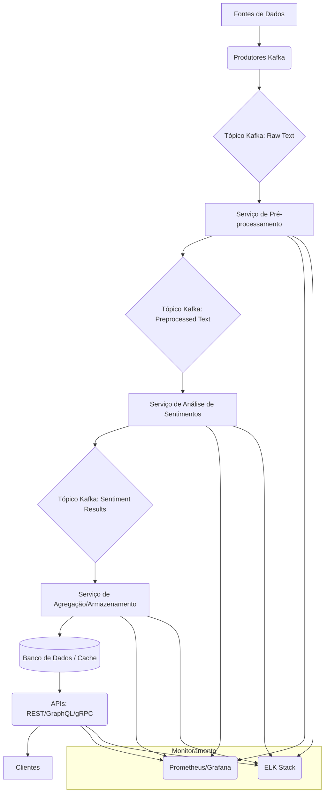
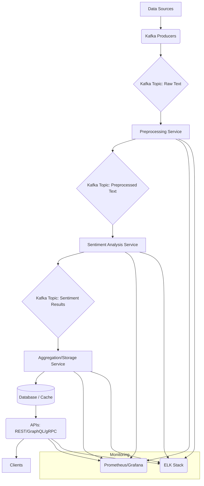

# 🇧🇷 Engine de Análise de Sentimentos Multi-Idioma


Um engine de análise de sentimentos de alta performance e escalável, capaz de processar texto em mais de 100 idiomas em tempo real. Este projeto utiliza modelos transformer state-of-the-art (BERT, XLM-RoBERTa) e uma arquitetura de microsserviços orientada a eventos para fornecer análise de sentimentos precisa e com baixa latência.

## 📋 Índice

- [Visão Geral](#visão-geral)
- [Funcionalidades](#funcionalidades)
- [Tecnologias Utilizadas](#tecnologias-utilizadas)
- [Arquitetura](#arquitetura)
- [Estrutura do Projeto](#estrutura-do-projeto)
- [Instalação](#instalação)
- [Uso](#uso)
- [Modelos](#modelos)
- [APIs](#apis)
- [Streaming](#streaming)
- [Monitoramento](#monitoramento)
- [Exemplos](#exemplos)
- [Contribuição](#contribuição)
- [Licença](#licença)
- [Contato](#contato)

## 🔍 Visão Geral

Este projeto implementa um engine de análise de sentimentos multi-idioma projetado para aplicações de larga escala e tempo real. O sistema é capaz de processar grandes volumes de texto de diversas fontes (mídias sociais, notícias, reviews) em mais de 100 idiomas, fornecendo insights valiosos sobre a opinião pública, reputação de marca e tendências de mercado.

A arquitetura é baseada em microsserviços e utiliza Apache Kafka para comunicação assíncrona e processamento de streaming. Modelos transformer pré-treinados e fine-tuned são utilizados para garantir alta precisão na análise de sentimentos, incluindo nuances como sarcasmo e análise baseada em aspectos.

## ✨ Funcionalidades

- **Análise Multi-Idioma**: Suporte para mais de 100 idiomas utilizando modelos como XLM-RoBERTa.
- **Modelos Transformer**: Utilização de modelos state-of-the-art (BERT, RoBERTa, XLM-R) para alta precisão.
- **Processamento em Tempo Real**: Arquitetura de streaming com Kafka para análise de baixa latência (<50ms).
- **Alta Escalabilidade**: Projetado para processar milhares de requisições por segundo.
- **Análise Avançada**: Detecção de emoções, análise baseada em aspectos (Aspect-Based Sentiment Analysis - ABSA), detecção de sarcasmo.
- **APIs Flexíveis**: Endpoints REST, GraphQL e gRPC para integração.
- **Monitoramento Completo**: Métricas de performance, detecção de drift de modelo, logs centralizados.
- **Treinamento e Fine-tuning**: Pipelines para fine-tuning de modelos em domínios específicos.

## 🛠️ Tecnologias Utilizadas

### Linguagens de Programação
- **Python**: Linguagem principal para desenvolvimento dos modelos e APIs.

### Frameworks e Bibliotecas
- **Transformers (Hugging Face)**: Para carregar e utilizar modelos pré-treinados.
- **TensorFlow/PyTorch**: Backend para os modelos transformer.
- **FastAPI**: Framework para construção das APIs REST.
- **Strawberry (GraphQL)**: Para a API GraphQL.
- **gRPC**: Para comunicação de alta performance entre serviços.
- **Kafka-Python**: Cliente Kafka para Python.
- **Scikit-learn**: Para pré-processamento e avaliação.
- **NLTK/SpaCy**: Ferramentas de pré-processamento de texto.

### Infraestrutura e Plataformas
- **Apache Kafka**: Plataforma de streaming de eventos.
- **Redis**: Cache para resultados e metadados.
- **Docker/Kubernetes**: Containerização e orquestração.
- **Prometheus/Grafana**: Monitoramento de métricas.
- **ELK Stack (Elasticsearch, Logstash, Kibana)**: Logging centralizado.
- **MLflow**: Rastreamento de experimentos e gerenciamento de modelos.

## 🏗️ Arquitetura

O sistema segue uma arquitetura de microsserviços orientada a eventos:

1.  **Ingestão de Dados**: Produtores enviam texto para tópicos Kafka (e.g., `social_media_stream`, `news_stream`).
2.  **Pré-processamento**: Um microsserviço consome os tópicos, realiza a limpeza e tokenização do texto, e publica em um tópico `preprocessed_text`.
3.  **Análise de Sentimentos**: Microsserviços especializados (um para cada modelo/idioma ou um serviço multi-modelo) consomem o tópico `preprocessed_text`, realizam a inferência e publicam os resultados (sentimento, emoção, aspectos) em tópicos como `sentiment_results`.
4.  **Agregação e Armazenamento**: Um serviço consome os resultados, agrega insights e armazena em um banco de dados (e.g., Elasticsearch, ClickHouse) e/ou cache (Redis).
5.  **APIs**: APIs (REST, GraphQL, gRPC) expõem os resultados e funcionalidades para os clientes.
6.  **Monitoramento**: Serviços de monitoramento coletam métricas e logs de todos os componentes.



## 📁 Estrutura do Projeto

```
multi-language-sentiment-engine/
├── src/
│   ├── models/                # Implementação dos modelos de sentimento
│   ├── api/                   # Código das APIs (FastAPI, GraphQL, gRPC)
│   ├── data/                  # Módulos de carregamento e acesso a dados
│   ├── preprocessing/         # Módulos de pré-processamento de texto
│   ├── evaluation/            # Scripts para avaliação de modelos
│   ├── streaming/             # Consumidores e produtores Kafka
│   └── visualization/         # Módulos para dashboards (opcional)
├── scripts/                   # Scripts utilitários (treinamento, deploy)
├── config/                    # Arquivos de configuração
├── data/                      # Dados de exemplo e datasets
├── docs/                      # Documentação adicional
├── deployment/                # Arquivos de deployment (Dockerfiles, Kubernetes YAMLs)
├── tests/                     # Testes automatizados
├── requirements.txt           # Dependências Python
└── README.md                  # Este arquivo
```

## 🚀 Instalação

### Pré-requisitos
- Python 3.8+
- Docker e Docker Compose
- Apache Kafka (pode ser executado via Docker Compose)
- Git

### Instalação

```bash
# Clone o repositório
git clone https://github.com/galafis/multi-language-sentiment-engine.git
cd multi-language-sentiment-engine

# Crie um ambiente virtual (recomendado)
python -m venv venv
source venv/bin/activate  # Linux/macOS
# venv\Scripts\activate  # Windows

# Instale as dependências
pip install -r requirements.txt

# Baixe os modelos pré-treinados (pode levar tempo e espaço)
python scripts/download_models.py

# Inicie os serviços dependentes (Kafka, Redis) via Docker Compose
docker-compose up -d kafka redis
```

## 📊 Uso

### Executando os Serviços

```bash
# Inicie o serviço de pré-processamento
python src/streaming/preprocessing_service.py

# Inicie o serviço de análise de sentimentos
python src/streaming/sentiment_analysis_service.py

# Inicie o serviço de agregação
python src/streaming/aggregation_service.py

# Inicie a API (exemplo com FastAPI)
cd src/api
uvicorn rest_api:app --reload --port 8000
```

### Enviando Texto para Análise (via Kafka)

```python
# Exemplo de produtor Kafka
from kafka import KafkaProducer
import json

producer = KafkaProducer(bootstrap_servers="localhost:9092",
                         value_serializer=lambda v: json.dumps(v).encode("utf-8"))

data = {
    "id": "tweet_123",
    "text": "This is a great product! Highly recommended.",
    "lang": "en",
    "timestamp": "2025-06-05T10:00:00Z"
}

producer.send("raw_text_en", value=data)
producer.flush()
```

### Consultando a API

```bash
# Exemplo com curl (API REST)
curl -X POST "http://localhost:8000/analyze" \
     -H "Content-Type: application/json" \
     -d 
```json
{
  "text": "Ce produit est incroyable!",
  "lang": "fr"
}
```

## 🧠 Modelos

O engine suporta diversos modelos transformer:

- **BERT (base, large, multilingual)**: Bom desempenho geral.
- **RoBERTa (base, large)**: Otimizado sobre o BERT.
- **XLM-RoBERTa (base, large)**: Modelo multi-idioma state-of-the-art.
- **Modelos específicos de domínio**: Fine-tuned para finanças (FinBERT), saúde, etc.
- **Modelos específicos de idioma**: Treinados para idiomas específicos para maior precisão.

O serviço de análise seleciona o modelo mais apropriado com base no idioma detectado ou especificado.

## 🌐 APIs

- **REST API (FastAPI)**: Endpoint `/analyze` para análise síncrona, endpoints para consulta de resultados agregados.
- **GraphQL API (Strawberry)**: Schema flexível para consultas customizadas de dados de sentimento.
- **gRPC API**: Interface de alta performance para comunicação entre serviços internos ou clientes que exigem baixa latência.

## 🌊 Streaming

- **Apache Kafka**: Utilizado como broker de mensagens para desacoplar os serviços e permitir processamento assíncrono e escalável.
- **Tópicos Principais**: `raw_text_<lang>`, `preprocessed_text`, `sentiment_results`, `aggregated_insights`.
- **Consumidores**: Implementados com `kafka-python`, com lógica de processamento, tratamento de erros e retentativas.

## 📈 Monitoramento

- **Métricas (Prometheus)**: Latência de processamento, taxa de transferência (throughput), utilização de recursos, contagem de erros.
- **Logs (ELK Stack)**: Logs centralizados de todos os microsserviços para debugging e auditoria.
- **Tracing (Jaeger/OpenTelemetry)**: Rastreamento de requisições através dos microsserviços.
- **Monitoramento de Modelo**: Detecção de drift de dados e performance do modelo.

## 📝 Exemplos

### Análise de Sentimento de Tweets em Tempo Real

- Um produtor consome a API do Twitter, filtra tweets relevantes e os envia para o tópico Kafka `raw_text_en`.
- Os serviços processam os tweets e os resultados são visualizados em um dashboard em tempo real.

### Análise de Reviews de Produtos Multi-idioma

- Reviews de e-commerce em diferentes idiomas são enviados para os tópicos Kafka correspondentes (`raw_text_fr`, `raw_text_es`, etc.).
- O engine analisa o sentimento geral e por aspecto (preço, qualidade, entrega) para cada produto.
- Relatórios agregados são gerados para análise de satisfação do cliente.

## 👥 Contribuição

Contribuições são bem-vindas! Por favor, sinta-se à vontade para enviar pull requests, criar issues ou sugerir melhorias.

1. Faça um fork do projeto
2. Crie sua branch de feature (`git checkout -b feature/amazing-feature`)
3. Commit suas mudanças (`git commit -m 'Add some amazing feature'`)
4. Push para a branch (`git push origin feature/amazing-feature`)
5. Abra um Pull Request

## 📄 Licença

Este projeto está licenciado sob a licença MIT - veja o arquivo [LICENSE](LICENSE) para detalhes.

## 📞 Contato

Gabriel Demetrios Lafis - [GitHub](https://github.com/galafis)

Link do projeto: [https://github.com/galafis/multi-language-sentiment-engine](https://github.com/galafis/multi-language-sentiment-engine)

---

# 🇬🇧 Multi-Language Sentiment Analysis Engine


A high-performance and scalable sentiment analysis engine capable of processing text in over 100 languages in real-time. This project utilizes state-of-the-art transformer models (BERT, XLM-RoBERTa) and an event-driven microservices architecture to provide accurate, low-latency sentiment analysis.

## 📋 Table of Contents

- [Overview](#overview)
- [Features](#features)
- [Technologies Used](#technologies-used)
- [Architecture](#architecture)
- [Project Structure](#project-structure)
- [Installation](#installation)
- [Usage](#usage)
- [Models](#models)
- [APIs](#apis)
- [Streaming](#streaming)
- [Monitoring](#monitoring)
- [Examples](#examples)
- [Contributing](#contributing)
- [License](#license)
- [Contact](#contact)

## 🔍 Overview

This project implements a multi-language sentiment analysis engine designed for large-scale, real-time applications. The system can process large volumes of text from various sources (social media, news, reviews) in over 100 languages, providing valuable insights into public opinion, brand reputation, and market trends.

The architecture is based on microservices and uses Apache Kafka for asynchronous communication and stream processing. Pre-trained and fine-tuned transformer models are used to ensure high accuracy in sentiment analysis, including nuances like sarcasm and aspect-based analysis.

## ✨ Features

- **Multi-Language Analysis**: Support for over 100 languages using models like XLM-RoBERTa.
- **Transformer Models**: Utilization of state-of-the-art models (BERT, RoBERTa, XLM-R) for high accuracy.
- **Real-Time Processing**: Streaming architecture with Kafka for low-latency analysis (<50ms).
- **High Scalability**: Designed to process thousands of requests per second.
- **Advanced Analysis**: Emotion detection, Aspect-Based Sentiment Analysis (ABSA), sarcasm detection.
- **Flexible APIs**: REST, GraphQL, and gRPC endpoints for integration.
- **Comprehensive Monitoring**: Performance metrics, model drift detection, centralized logging.
- **Training and Fine-tuning**: Pipelines for fine-tuning models on specific domains.

## 🛠️ Technologies Used

### Programming Languages
- **Python**: Main language for model and API development.

### Frameworks and Libraries
- **Transformers (Hugging Face)**: For loading and using pre-trained models.
- **TensorFlow/PyTorch**: Backend for transformer models.
- **FastAPI**: Framework for building REST APIs.
- **Strawberry (GraphQL)**: For the GraphQL API.
- **gRPC**: For high-performance communication between services.
- **Kafka-Python**: Kafka client for Python.
- **Scikit-learn**: For preprocessing and evaluation.
- **NLTK/SpaCy**: Text preprocessing tools.

### Infrastructure and Platforms
- **Apache Kafka**: Event streaming platform.
- **Redis**: Cache for results and metadata.
- **Docker/Kubernetes**: Containerization and orchestration.
- **Prometheus/Grafana**: Metrics monitoring.
- **ELK Stack (Elasticsearch, Logstash, Kibana)**: Centralized logging.
- **MLflow**: Experiment tracking and model management.

## 🏗️ Architecture

The system follows an event-driven microservices architecture:

1.  **Data Ingestion**: Producers send text to Kafka topics (e.g., `social_media_stream`, `news_stream`).
2.  **Preprocessing**: A microservice consumes the topics, performs text cleaning and tokenization, and publishes to a `preprocessed_text` topic.
3.  **Sentiment Analysis**: Specialized microservices (one per model/language or a multi-model service) consume the `preprocessed_text` topic, perform inference, and publish results (sentiment, emotion, aspects) to topics like `sentiment_results`.
4.  **Aggregation and Storage**: A service consumes the results, aggregates insights, and stores them in a database (e.g., Elasticsearch, ClickHouse) and/or cache (Redis).
5.  **APIs**: APIs (REST, GraphQL, gRPC) expose the results and functionalities to clients.
6.  **Monitoring**: Monitoring services collect metrics and logs from all components.



## 📁 Project Structure

```
multi-language-sentiment-engine/
├── src/
│   ├── models/                # Implementation of sentiment models
│   ├── api/                   # API code (FastAPI, GraphQL, gRPC)
│   ├── data/                  # Data loading and access modules
│   ├── preprocessing/         # Text preprocessing modules
│   ├── evaluation/            # Scripts for model evaluation
│   ├── streaming/             # Kafka consumers and producers
│   └── visualization/         # Modules for dashboards (optional)
├── scripts/                   # Utility scripts (training, deployment)
├── config/                    # Configuration files
├── data/                      # Example data and datasets
├── docs/                      # Additional documentation
├── deployment/                # Deployment files (Dockerfiles, Kubernetes YAMLs)
├── tests/                     # Automated tests
├── requirements.txt           # Python dependencies
└── README.md                  # This file
```

## 🚀 Installation

### Prerequisites
- Python 3.8+
- Docker and Docker Compose
- Apache Kafka (can be run via Docker Compose)
- Git

### Installation

```bash
# Clone the repository
git clone https://github.com/galafis/multi-language-sentiment-engine.git
cd multi-language-sentiment-engine

# Create a virtual environment (recommended)
python -m venv venv
source venv/bin/activate  # Linux/macOS
# venv\Scripts\activate  # Windows

# Install dependencies
pip install -r requirements.txt

# Download pre-trained models (may take time and space)
python scripts/download_models.py

# Start dependent services (Kafka, Redis) via Docker Compose
docker-compose up -d kafka redis
```

## 📊 Usage

### Running the Services

```bash
# Start the preprocessing service
python src/streaming/preprocessing_service.py

# Start the sentiment analysis service
python src/streaming/sentiment_analysis_service.py

# Start the aggregation service
python src/streaming/aggregation_service.py

# Start the API (example with FastAPI)
cd src/api
uvicorn rest_api:app --reload --port 8000
```

### Sending Text for Analysis (via Kafka)

```python
# Example Kafka producer
from kafka import KafkaProducer
import json

producer = KafkaProducer(bootstrap_servers="localhost:9092",
                         value_serializer=lambda v: json.dumps(v).encode("utf-8"))

data = {
    "id": "tweet_123",
    "text": "This is a great product! Highly recommended.",
    "lang": "en",
    "timestamp": "2025-06-05T10:00:00Z"
}

producer.send("raw_text_en", value=data)
producer.flush()
```

### Querying the API

```bash
# Example with curl (REST API)
curl -X POST "http://localhost:8000/analyze" \
     -H "Content-Type: application/json" \
     -d 
```json
{
  "text": "Ce produit est incroyable!",
  "lang": "fr"
}
```

## 🧠 Models

The engine supports various transformer models:

- **BERT (base, large, multilingual)**: Good general performance.
- **RoBERTa (base, large)**: Optimized over BERT.
- **XLM-RoBERTa (base, large)**: State-of-the-art multi-language model.
- **Domain-specific models**: Fine-tuned for finance (FinBERT), healthcare, etc.
- **Language-specific models**: Trained for specific languages for higher accuracy.

The analysis service selects the most appropriate model based on the detected or specified language.

## 🌐 APIs

- **REST API (FastAPI)**: `/analyze` endpoint for synchronous analysis, endpoints for querying aggregated results.
- **GraphQL API (Strawberry)**: Flexible schema for custom queries of sentiment data.
- **gRPC API**: High-performance interface for communication between internal services or clients requiring low latency.

## 🌊 Streaming

- **Apache Kafka**: Used as the message broker to decouple services and enable asynchronous, scalable processing.
- **Main Topics**: `raw_text_<lang>`, `preprocessed_text`, `sentiment_results`, `aggregated_insights`.
- **Consumers**: Implemented with `kafka-python`, including processing logic, error handling, and retries.

## 📈 Monitoring

- **Metrics (Prometheus)**: Processing latency, throughput, resource utilization, error counts.
- **Logs (ELK Stack)**: Centralized logs from all microservices for debugging and auditing.
- **Tracing (Jaeger/OpenTelemetry)**: Request tracing across microservices.
- **Model Monitoring**: Detection of data drift and model performance degradation.

## 📝 Examples

### Real-Time Tweet Sentiment Analysis

- A producer consumes the Twitter API, filters relevant tweets, and sends them to the `raw_text_en` Kafka topic.
- The services process the tweets, and results are visualized on a real-time dashboard.

### Multi-Language Product Review Analysis

- E-commerce reviews in different languages are sent to corresponding Kafka topics (`raw_text_fr`, `raw_text_es`, etc.).
- The engine analyzes overall and aspect-based sentiment (price, quality, delivery) for each product.
- Aggregated reports are generated for customer satisfaction analysis.

## 👥 Contributing

Contributions are welcome! Please feel free to submit pull requests, create issues, or suggest improvements.

1. Fork the project
2. Create your feature branch (`git checkout -b feature/amazing-feature`)
3. Commit your changes (`git commit -m 'Add some amazing feature'`)
4. Push to the branch (`git push origin feature/amazing-feature`)
5. Open a Pull Request

## 📄 License

This project is licensed under the MIT License - see the [LICENSE](LICENSE) file for details.

## 📞 Contact

Gabriel Demetrios Lafis - [GitHub](https://github.com/galafis)

Project Link: [https://github.com/galafis/multi-language-sentiment-engine](https://github.com/galafis/multi-language-sentiment-engine)

