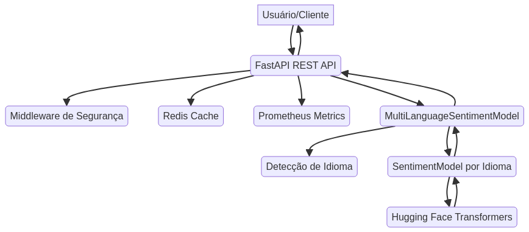

# Multi-Language Sentiment Engine

[](https://www.python.org/)
[](https://fastapi.tiangolo.com/)
[](https://huggingface.co/docs/transformers/index)
[](https://pytorch.org/)
[](https://redis.io/)
[](https://prometheus.io/)
[](LICENSE)

---

## 🇧🇷 Português

### Visão Geral

Este repositório apresenta um **Mecanismo de Análise de Sentimento Multi-idioma** robusto e escalável, desenvolvido para processar e analisar o sentimento de textos em diversas línguas. Utilizando modelos de *transformers* de última geração, o sistema oferece capacidades de análise de sentimento, detecção de emoções e análise baseada em aspectos, tudo através de uma API RESTful de alta performance. O objetivo é fornecer uma solução flexível e eficiente para a compreensão do sentimento em dados textuais, com foco em aplicações de larga escala e tempo real.

### Funcionalidades Principais

*   **Análise de Sentimento Multi-idioma**: Suporte para múltiplos idiomas com modelos otimizados para cada língua, garantindo alta precisão e relevância cultural.
*   **Detecção de Emoções**: Identificação de emoções como alegria, tristeza, raiva, medo, surpresa, desgosto e neutralidade, proporcionando uma compreensão mais profunda do texto.
*   **Análise de Sentimento Baseada em Aspectos (ABSA)**: Avaliação do sentimento em relação a aspectos específicos mencionados no texto, permitindo análises granulares de produtos, serviços ou tópicos.
*   **Detecção de Sarcasmo**: Capacidade de identificar sarcasmo em textos, crucial para a interpretação correta de nuances na comunicação online.
*   **API RESTful com FastAPI**: Interface de programação de aplicações (API) moderna e eficiente, construída com FastAPI para alta performance e fácil integração.
*   **Métricas e Monitoramento**: Integração com Prometheus para monitoramento detalhado do desempenho da API e dos modelos, facilitando a observabilidade e a manutenção.
*   **Cache com Redis**: Otimização de performance através de cache de resultados de análise, reduzindo a latência e a carga computacional para requisições repetidas.
*   **Arquitetura Modular**: Código bem organizado e modular, facilitando a manutenção, escalabilidade e a adição de novas funcionalidades.

### Arquitetura do Sistema

O diagrama abaixo ilustra a arquitetura do Mecanismo de Análise de Sentimento Multi-idioma:



### Tecnologias Utilizadas

*   **Python**: Linguagem de programação principal, escolhida por sua vasta biblioteca de ML e NLP.
*   **FastAPI**: Framework web assíncrono para construção da API RESTful de alta performance.
*   **Hugging Face Transformers**: Biblioteca essencial para o uso de modelos de linguagem baseados em transformers.
*   **PyTorch**: Biblioteca de aprendizado de máquina que serve como backend para os modelos de transformers.
*   **Redis**: Banco de dados em memória utilizado para cache de resultados e otimização de performance.
*   **Prometheus**: Sistema de monitoramento e alerta para coletar e visualizar métricas da aplicação.

### Instalação e Uso

Para configurar e executar o projeto localmente, siga os passos abaixo:

1.  **Clone o repositório**:
    ```bash
    git clone https://github.com/GabrielDemetriosLafis/multi-language-sentiment-engine.git
    cd multi-language-sentiment-engine
    ```

2.  **Instale as dependências**:
    ```bash
    pip install -r requirements.txt
    ```

3.  **Execute a API**:
    ```bash
    uvicorn src.api.rest_api:app --host 0.0.0.0 --port 8000 --reload
    ```
    A API estará disponível em `http://localhost:8000`.

### Exemplos de Uso da API

Você pode interagir com a API usando `curl` ou qualquer cliente HTTP.

#### Análise de Sentimento

```bash
curl -X POST "http://localhost:8000/analyze" \
     -H "Authorization: Bearer demo" \
     -H "Content-Type: application/json" \
     -d \'{"text": "Eu amo este produto!", "language": "pt"}\'
```

#### Detecção de Emoções

```bash
curl -X POST "http://localhost:8000/analyze/emotion" \
     -H "Authorization: Bearer demo" \
     -H "Content-Type: application/json" \
     -d \'{"text": "Estou muito feliz hoje!", "language": "pt"}\'
```

#### Análise de Sentimento Baseada em Aspectos

```bash
curl -X POST "http://localhost:8000/analyze/aspect" \
     -H "Authorization: Bearer demo" \
     -H "Content-Type: application/json" \
     -d \'{"text": "A comida estava ótima, mas o serviço foi lento.", "aspects": ["comida", "serviço"], "language": "pt"}\'
```

#### Detecção de Sarcasmo

```bash
curl -X POST "http://localhost:8000/analyze/sarcasm" \
     -H "Authorization: Bearer demo" \
     -H "Content-Type: application/json" \
     -d \'{"text": "Ah, que ótimo, outra segunda-feira!", "language": "pt"}\'
```

### Documentação da API

Acesse a documentação interativa (Swagger UI) em `http://localhost:8000/docs`.

---

## 🇬🇧 English

### Overview

This repository presents a robust and scalable **Multi-Language Sentiment Analysis Engine**, designed to process and analyze the sentiment of texts in various languages. Utilizing state-of-the-art *transformer* models, the system offers sentiment analysis, emotion detection, and aspect-based analysis capabilities, all through a high-performance RESTful API. The goal is to provide a flexible and efficient solution for understanding sentiment in textual data, with a focus on large-scale and real-time applications.

### Key Features

*   **Multi-Language Sentiment Analysis**: Support for multiple languages with optimized models for each language, ensuring high accuracy and cultural relevance.
*   **Emotion Detection**: Identification of emotions such as joy, sadness, anger, fear, surprise, disgust, and neutrality, providing a deeper understanding of the text.
*   **Aspect-Based Sentiment Analysis (ABSA)**: Evaluation of sentiment regarding specific aspects mentioned in the text, allowing granular analysis of products, services, or topics.
*   **Sarcasm Detection**: Ability to identify sarcasm in texts, crucial for correctly interpreting nuances in online communication.
*   **RESTful API with FastAPI**: Modern and efficient Application Programming Interface (API), built with FastAPI for high performance and easy integration.
*   **Metrics and Monitoring**: Integration with Prometheus for detailed monitoring of API and model performance, facilitating observability and maintenance.
*   **Caching with Redis**: Performance optimization through result caching, reducing latency and computational load for repeated requests.
*   **Modular Architecture**: Well-organized and modular code, facilitating maintenance, scalability, and the addition of new functionalities.

### System Architecture

The diagram below illustrates the architecture of the Multi-Language Sentiment Analysis Engine:


### Technologies Used

*   **Python**: Main programming language, chosen for its vast ML and NLP library ecosystem.
*   **FastAPI**: Asynchronous web framework for building the high-performance RESTful API.
*   **Hugging Face Transformers**: Essential library for using transformer-based language models.
*   **PyTorch**: Machine learning library serving as the backend for transformer models.
*   **Redis**: In-memory database used for result caching and performance optimization.
*   **Prometheus**: Monitoring and alerting system for collecting and visualizing application metrics.

### Installation and Usage

To set up and run the project locally, follow the steps below:

1.  **Clone the repository**:
    ```bash
    git clone https://github.com/GabrielDemetriosLafis/multi-language-sentiment-engine.git
    cd multi-language-sentiment-engine
    ```

2.  **Install the dependencies**:
    ```bash
    pip install -r requirements.txt
    ```

3.  **Run the API**:
    ```bash
    uvicorn src.api.rest_api:app --host 0.0.0.0 --port 8000 --reload
    ```
    The API will be available at `http://localhost:8000`.

### API Usage Examples

You can interact with the API using `curl` or any HTTP client.

#### Sentiment Analysis

```bash
curl -X POST "http://localhost:8000/analyze" \
     -H "Authorization: Bearer demo" \
     -H "Content-Type: application/json" \
     -d \'{"text": "I love this product!", "language": "en"}\'
```

#### Emotion Detection

```bash
curl -X POST "http://localhost:8000/analyze/emotion" \
     -H "Authorization: Bearer demo" \
     -H "Content-Type: application/json" \
     -d \'{"text": "I am so happy today!", "language": "en"}\'
```

#### Aspect-Based Sentiment Analysis

```bash
curl -X POST "http://localhost:8000/analyze/aspect" \
     -H "Authorization: Bearer demo" \
     -H "Content-Type: application/json" \
     -d \'{"text": "The food was great but the service was slow.", "aspects": ["food", "service"], "language": "en"}\'
```

#### Sarcasm Detection

```bash
curl -X POST "http://localhost:8000/analyze/sarcasm" \
     -H "Authorization: Bearer demo" \
     -H "Content-Type: application/json" \
     -d \'{"text": "Oh, great, another Monday!", "language": "en"}\'
```

### API Documentation

Access the interactive documentation (Swagger UI) at `http://localhost:8000/docs`.

---

**Author**: Gabriel Demetrios Lafis

