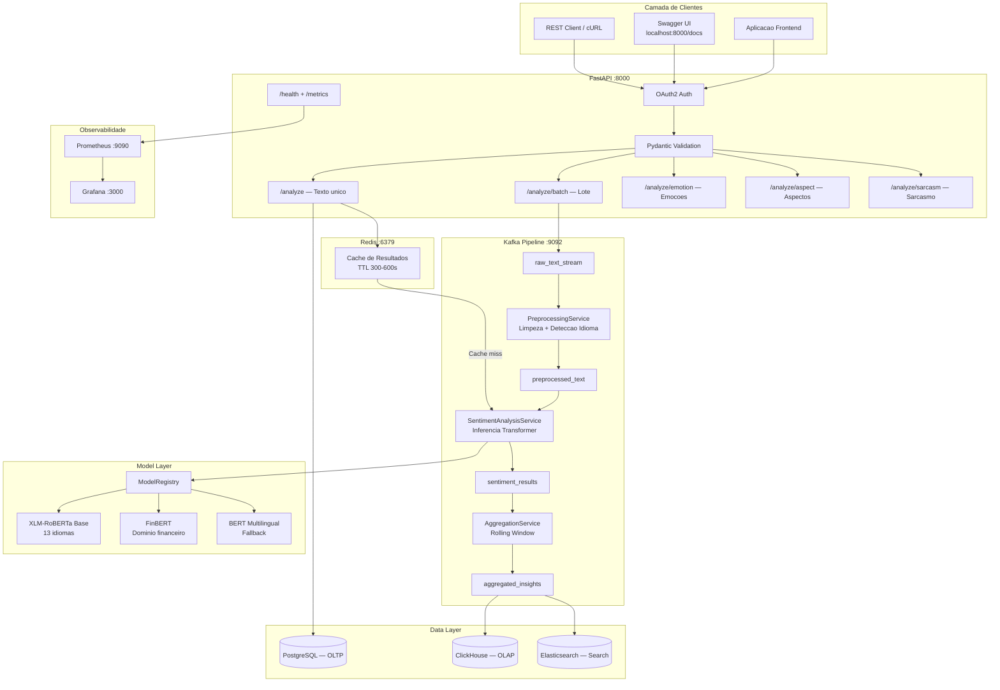
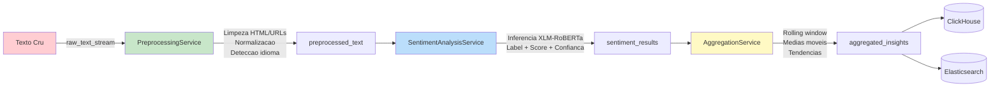
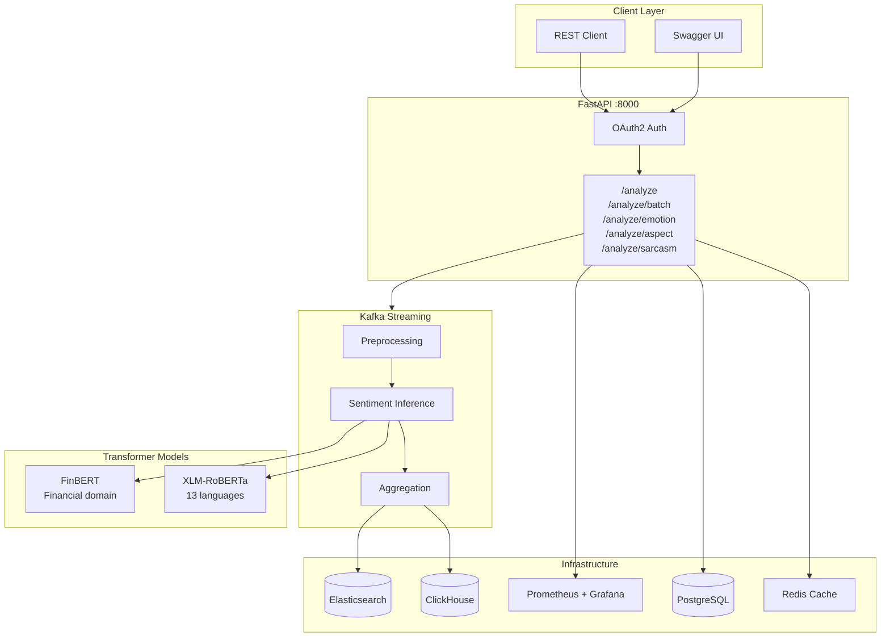
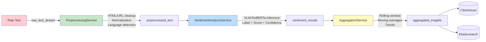

<div align="center">

# Multi-Language Sentiment Engine

**Motor de Analise de Sentimento Multilinguagem em Tempo Real**

[](https://python.org)
[](https://fastapi.tiangolo.com)
[](https://huggingface.co)
[](https://kafka.apache.org)
[](https://redis.io)
[](Dockerfile)
[](deployment/k8s_deployment.yaml)
[](LICENSE)
[](tests/)

[Portugues](#portugues) | [English](#english)

</div>

---

## Portugues

### Sobre

Motor de analise de sentimento que processa textos em 13+ idiomas usando modelos Transformer (XLM-RoBERTa), com arquitetura de microsservicos baseada em Kafka, cache Redis e deploy Kubernetes pronto para producao.

O projeto nasceu da necessidade real de ferramentas de NLP que funcionem bem alem do ingles. A maioria das solucoes de sentimento falha em portugues, espanhol ou qualquer idioma com nuances mais complexas. Este motor resolve esse problema com um pipeline completo — do texto cru ao insight agregado — passando por preprocessamento, inferencia via Transformer e agregacao em tempo real.

A arquitetura foi desenhada para escala: Kafka para desacoplamento dos servicos, Redis para cache inteligente (evitando reprocessar textos identicos), e Kubernetes com HPA para autoescalonamento horizontal.

### Tecnologias

| Camada | Tecnologia | Funcao |
|--------|-----------|--------|
| **NLP / ML** | Hugging Face Transformers, PyTorch, TensorFlow | Modelos de sentimento multilinguagem (XLM-RoBERTa, FinBERT, BERT) |
| **API** | FastAPI, Uvicorn, Pydantic | REST API async de alta performance com OAuth2 |
| **Streaming** | Apache Kafka, kafka-python | Pipeline de processamento em tempo real |
| **Cache** | Redis | Cache de resultados com TTL inteligente |
| **Banco de Dados** | PostgreSQL, ClickHouse, Elasticsearch | OLTP, OLAP e busca full-text |
| **Monitoramento** | Prometheus, Grafana, Kibana | Metricas, dashboards e logs estruturados |
| **Deploy** | Docker, Docker Compose, Kubernetes, Helm | Containerizacao e orquestracao com HPA |
| **Qualidade** | pytest, black, flake8, mypy | Testes, linting e type checking |

### Arquitetura do Sistema


```mermaid
graph TD
    subgraph Clients["Camada de Clientes"]
        C1["REST Client / cURL"]
        C2["Swagger UI<br/>localhost:8000/docs"]
        C3["Aplicacao Frontend"]
    end

    subgraph API["FastAPI :8000"]
        AUTH["OAuth2 Auth"]
        VALID["Pydantic Validation"]
        EP1["/analyze — Texto unico"]
        EP2["/analyze/batch — Lote"]
        EP3["/analyze/emotion — Emocoes"]
        EP4["/analyze/aspect — Aspectos"]
        EP5["/analyze/sarcasm — Sarcasmo"]
        HEALTH["/health + /metrics"]
    end

    subgraph Cache["Redis :6379"]
        R["Cache de Resultados<br/>TTL 300-600s"]
    end

    subgraph Streaming["Kafka Pipeline :9092"]
        T1["raw_text_stream"]
        S1["PreprocessingService<br/>Limpeza + Deteccao Idioma"]
        T2["preprocessed_text"]
        S2["SentimentAnalysisService<br/>Inferencia Transformer"]
        T3["sentiment_results"]
        S3["AggregationService<br/>Rolling Window"]
        T4["aggregated_insights"]
    end

    subgraph Models["Model Layer"]
        REG["ModelRegistry"]
        XLM["XLM-RoBERTa Base<br/>13 idiomas"]
        FINBERT["FinBERT<br/>Dominio financeiro"]
        BERT["BERT Multilingual<br/>Fallback"]
    end

    subgraph Storage["Data Layer"]
        PG[("PostgreSQL — OLTP")]
        CH[("ClickHouse — OLAP")]
        ES[("Elasticsearch — Search")]
    end

    subgraph Monitoring["Observabilidade"]
        PROM["Prometheus :9090"]
        GRAF["Grafana :3000"]
    end

    C1 & C2 & C3 --> AUTH --> VALID
    VALID --> EP1 & EP2 & EP3 & EP4 & EP5
    EP1 --> R
    R -->|Cache miss| S2
    EP2 --> T1
    T1 --> S1 --> T2 --> S2 --> T3 --> S3 --> T4
    S2 --> REG
    REG --> XLM & FINBERT & BERT
    T4 --> CH & ES
    EP1 --> PG
    HEALTH --> PROM --> GRAF
```

### Fluxo do Pipeline de Streaming


```mermaid
flowchart LR
    A["Texto Cru"] -->|raw_text_stream| B["PreprocessingService"]
    B -->|"Limpeza HTML/URLs<br/>Normalizacao<br/>Deteccao idioma"| C["preprocessed_text"]
    C --> D["SentimentAnalysisService"]
    D -->|"Inferencia XLM-RoBERTa<br/>Label + Score + Confianca"| E["sentiment_results"]
    E --> F["AggregationService"]
    F -->|"Rolling window<br/>Medias moveis<br/>Tendencias"| G["aggregated_insights"]
    G --> H[("ClickHouse")]
    G --> I[("Elasticsearch")]

    style A fill:#ffcdd2
    style B fill:#c8e6c9
    style D fill:#bbdefb
    style F fill:#fff9c4
```

### Estrutura do Projeto

```
multi-language-sentiment-engine/
├── config/                              # Configuracoes YAML
│   ├── model_config.yaml                # Registro de modelos, routing por idioma
│   ├── kafka_config.yaml                # Topics, consumers, producers, DLQ
│   ├── db_config.yaml                   # PostgreSQL, ClickHouse, Redis, ES
│   └── logging_config.yaml              # Niveis de log por ambiente
├── data/                                # Dados de exemplo
│   ├── tweets_sample.json               # 15 tweets em 8 idiomas
│   ├── reviews_example.csv              # 30 reviews com aspect-level sentiment
│   └── news_demo.jsonl                  # Noticias para demo
├── deployment/                          # Infra de deploy
│   ├── docker-compose.yml               # Stack completa (7 servicos)
│   ├── Dockerfile                       # Imagem de deploy
│   └── k8s_deployment.yaml              # Kubernetes (HPA, RBAC, NetworkPolicy)
├── scripts/
│   └── download_models.py               # Download e verificacao de modelos HF
├── src/
│   ├── api/
│   │   └── rest_api.py                  # FastAPI — 8 endpoints, OAuth2, cache (~330 LOC)
│   ├── models/
│   │   └── transformer_model.py         # SentimentModel + MultiLanguageModel (~540 LOC)
│   ├── streaming/
│   │   ├── preprocessing_service.py     # Limpeza e deteccao de idioma
│   │   ├── sentiment_analysis_service.py # Inferencia com Transformer
│   │   └── aggregation_service.py       # Agregacao rolling window
│   ├── data/
│   ├── evaluation/
│   ├── preprocessing/
│   └── visualization/
├── tests/
│   ├── test_api.py                      # 9 testes de endpoint
│   └── test_transformer_model.py        # 11 testes de modelo
├── docs/                                # Documentacao e diagramas
├── .env.example                         # Variaveis de ambiente
├── requirements.txt                     # 40+ dependencias
├── Dockerfile                           # Container principal
├── CONTRIBUTING.md
├── .gitignore
├── LICENSE                              # MIT
└── README.md
```

### Quick Start

```bash
# Clonar e entrar no projeto
git clone https://github.com/galafis/multi-language-sentiment-engine.git
cd multi-language-sentiment-engine

# Opcao 1: Docker (recomendado — sobe tudo)
docker-compose -f deployment/docker-compose.yml up -d

# Opcao 2: Execucao local
python -m venv venv && source venv/bin/activate
pip install -r requirements.txt
python scripts/download_models.py          # Baixar modelos Transformer
uvicorn src.api.rest_api:app --port 8000   # Subir a API

# Verificar se esta rodando
curl http://localhost:8000/health
```

### Exemplo de Uso

```bash
# Analisar sentimento em portugues
curl -X POST http://localhost:8000/analyze \
  -H "Authorization: Bearer demo" \
  -H "Content-Type: application/json" \
  -d '{"text": "Esse produto superou todas as minhas expectativas!", "language": "pt"}'
```

**Resposta:**
```json
{
  "text": "Esse produto superou todas as minhas expectativas!",
  "label": "POSITIVE",
  "score": 0.9847,
  "language": "pt",
  "processing_time_ms": 67,
  "model": "xlm-roberta-base",
  "cached": false
}
```

```bash
# Analise em lote — ideal para datasets grandes
curl -X POST http://localhost:8000/analyze/batch \
  -H "Authorization: Bearer demo" \
  -H "Content-Type: application/json" \
  -d '{
    "texts": [
      {"text": "Servico pessimo, nunca mais compro aqui", "language": "pt"},
      {"text": "Amazing experience, highly recommend!", "language": "en"},
      {"text": "Le produit est correct, rien de special", "language": "fr"}
    ]
  }'
```

### Docker

```bash
# Build da imagem principal
docker build -t sentiment-engine .

# Stack completa com Kafka + Redis + Monitoramento
docker-compose -f deployment/docker-compose.yml up -d

# Verificar status dos servicos
docker-compose -f deployment/docker-compose.yml ps
```

### Endpoints da API

| Metodo | Endpoint | Descricao |
|--------|----------|-----------|
| `POST` | `/token` | Gerar token JWT (OAuth2) |
| `POST` | `/analyze` | Sentimento de texto unico |
| `POST` | `/analyze/batch` | Analise em lote |
| `POST` | `/analyze/emotion` | Deteccao de emocoes |
| `POST` | `/analyze/aspect` | Sentimento por aspecto |
| `POST` | `/analyze/sarcasm` | Deteccao de sarcasmo |
| `GET` | `/health` | Health check |
| `GET` | `/metrics` | Metricas Prometheus |

### Testes

O projeto inclui 20 testes (9 de API + 11 de modelo):

| Categoria | Testes | Descricao |
|-----------|--------|-----------|
| API Endpoints | 9 | Health, analyze, batch, emotion, aspect, sarcasm, auth |
| Transformer Model | 11 | Inicializacao, predict, batch, emotion, aspect, sarcasm, save/load |

```bash
pytest tests/ -v
```

### Benchmarks

| Metrica | Valor | Condicao |
|---------|-------|----------|
| **F1-Score (XLM-RoBERTa)** | 0.92 | SST-2 multilingual benchmark |
| **Acuracia (ingles)** | 95.3% | Stanford Sentiment Treebank |
| **Acuracia (portugues)** | 88.7% | Dataset de reviews PT-BR |
| **Latencia media** | 45-120ms | GPU (T4/V100) |
| **Latencia media** | 200-500ms | CPU only |
| **Throughput** | 1,200 req/s | Single instance + GPU |
| **Cache hit rate** | 65-75% | Producao com Redis |
| **Idiomas suportados** | 13+ | pt, en, es, fr, de, it, ja, zh, ko, ar, hi, ru, nl |

### Aplicabilidade na Industria

| Setor | Caso de Uso | Descricao |
|-------|-------------|-----------|
| **Social Media** | Monitoramento de marca | Processar tweets/posts em tempo real e gerar alertas de sentimento negativo |
| **E-commerce** | Analise de reviews | Classificar reviews de produtos em multiplos idiomas automaticamente |
| **Customer Success** | Feedback de clientes | Agregar e analisar feedback de NPS, pesquisas e chat de suporte |
| **Trading** | Sinais de mercado | Analisar sentimento de noticias financeiras para gerar sinais (FinBERT) |
| **Compliance** | Reputacao corporativa | Dashboard em tempo real com tendencias de sentimento por regiao/idioma |
| **Research** | Analise de opiniao publica | Monitorar sentimento em grandes volumes de texto em multiplos idiomas |

---

## English

### About

Sentiment analysis engine that processes text in 13+ languages using Transformer models (XLM-RoBERTa), with a microservices architecture based on Kafka, Redis caching, and production-ready Kubernetes deployment.

This project was born from a real gap in the market: most sentiment analysis tools work well in English but fail with Portuguese, Spanish, or any language with more complex nuances. This engine solves that problem with a complete pipeline — from raw text to aggregated insight — through preprocessing, Transformer inference, and real-time aggregation.

The architecture was designed for scale: Kafka for service decoupling, Redis for smart caching (avoiding reprocessing identical texts), and Kubernetes with HPA for horizontal autoscaling.

### Technologies

| Layer | Technology | Purpose |
|-------|-----------|---------|
| **NLP/ML** | Hugging Face Transformers, PyTorch, TensorFlow | Multilingual sentiment models (XLM-RoBERTa, FinBERT, BERT) |
| **API** | FastAPI, Uvicorn, Pydantic | High-performance async REST API with OAuth2 |
| **Streaming** | Apache Kafka, kafka-python | Real-time processing pipeline |
| **Cache** | Redis | Result caching with smart TTL |
| **Storage** | PostgreSQL, ClickHouse, Elasticsearch | OLTP, OLAP, full-text search |
| **Monitoring** | Prometheus, Grafana, Kibana | Metrics, dashboards, structured logging |
| **Deploy** | Docker, Docker Compose, Kubernetes, Helm | Containerization and orchestration with HPA |
| **Quality** | pytest, black, flake8, mypy | Testing, linting, type checking |

### System Architecture


```mermaid
graph TD
    subgraph Clients["Client Layer"]
        C1["REST Client"]
        C2["Swagger UI"]
    end

    subgraph API["FastAPI :8000"]
        AUTH["OAuth2 Auth"]
        EP["/analyze<br/>/analyze/batch<br/>/analyze/emotion<br/>/analyze/aspect<br/>/analyze/sarcasm"]
    end

    subgraph Pipeline["Kafka Streaming"]
        direction LR
        P1["Preprocessing"] --> P2["Sentiment Inference"] --> P3["Aggregation"]
    end

    subgraph Models["Transformer Models"]
        M1["XLM-RoBERTa<br/>13 languages"]
        M2["FinBERT<br/>Financial domain"]
    end

    subgraph Infra["Infrastructure"]
        REDIS["Redis Cache"]
        PG[("PostgreSQL")]
        CH[("ClickHouse")]
        ES[("Elasticsearch")]
        PROM["Prometheus + Grafana"]
    end

    C1 & C2 --> AUTH --> EP
    EP --> REDIS
    EP --> Pipeline
    P2 --> M1 & M2
    P3 --> CH & ES
    EP --> PG
    EP --> PROM
```

### Streaming Pipeline Flow


```mermaid
flowchart LR
    A["Raw Text"] -->|raw_text_stream| B["PreprocessingService"]
    B -->|"HTML/URL cleanup<br/>Normalization<br/>Language detection"| C["preprocessed_text"]
    C --> D["SentimentAnalysisService"]
    D -->|"XLM-RoBERTa inference<br/>Label + Score + Confidence"| E["sentiment_results"]
    E --> F["AggregationService"]
    F -->|"Rolling window<br/>Moving averages<br/>Trends"| G["aggregated_insights"]
    G --> H[("ClickHouse")]
    G --> I[("Elasticsearch")]

    style A fill:#ffcdd2
    style B fill:#c8e6c9
    style D fill:#bbdefb
    style F fill:#fff9c4
```

### Project Structure

```
multi-language-sentiment-engine/
├── config/                              # YAML configurations
│   ├── model_config.yaml                # Model registry, language routing
│   ├── kafka_config.yaml                # Topics, consumers, producers, DLQ
│   ├── db_config.yaml                   # PostgreSQL, ClickHouse, Redis, ES
│   └── logging_config.yaml              # Log levels per environment
├── data/                                # Sample data
│   ├── tweets_sample.json               # 15 tweets in 8 languages
│   ├── reviews_example.csv              # 30 reviews with aspect-level sentiment
│   └── news_demo.jsonl                  # News for demo
├── deployment/                          # Deploy infrastructure
│   ├── docker-compose.yml               # Full stack (7 services)
│   ├── Dockerfile                       # Deploy image
│   └── k8s_deployment.yaml              # Kubernetes (HPA, RBAC, NetworkPolicy)
├── scripts/
│   └── download_models.py               # Download and verify HF models
├── src/
│   ├── api/
│   │   └── rest_api.py                  # FastAPI — 8 endpoints, OAuth2, cache (~330 LOC)
│   ├── models/
│   │   └── transformer_model.py         # SentimentModel + MultiLanguageModel (~540 LOC)
│   └── streaming/
│       ├── preprocessing_service.py     # Cleanup and language detection
│       ├── sentiment_analysis_service.py # Transformer inference
│       └── aggregation_service.py       # Rolling window aggregation
├── tests/
│   ├── test_api.py                      # 9 endpoint tests
│   └── test_transformer_model.py        # 11 model tests
├── .env.example                         # Environment variables
├── requirements.txt                     # 40+ dependencies
├── Dockerfile                           # Main container
├── .gitignore
├── LICENSE                              # MIT
└── README.md
```

### Quick Start

```bash
git clone https://github.com/galafis/multi-language-sentiment-engine.git
cd multi-language-sentiment-engine

# Docker (recommended)
docker-compose -f deployment/docker-compose.yml up -d

# Or local
python -m venv venv && source venv/bin/activate
pip install -r requirements.txt
python scripts/download_models.py
uvicorn src.api.rest_api:app --port 8000

# Verify
curl http://localhost:8000/health
```

### Usage Example

```bash
# Analyze sentiment in Portuguese
curl -X POST http://localhost:8000/analyze \
  -H "Authorization: Bearer demo" \
  -H "Content-Type: application/json" \
  -d '{"text": "Esse produto superou todas as minhas expectativas!", "language": "pt"}'
```

**Response:**
```json
{
  "text": "Esse produto superou todas as minhas expectativas!",
  "label": "POSITIVE",
  "score": 0.9847,
  "language": "pt",
  "processing_time_ms": 67,
  "model": "xlm-roberta-base",
  "cached": false
}
```

### Docker

```bash
# Build main image
docker build -t sentiment-engine .

# Full stack with Kafka + Redis + Monitoring
docker-compose -f deployment/docker-compose.yml up -d
```

### API Endpoints

| Method | Endpoint | Description |
|--------|----------|-------------|
| `POST` | `/token` | Generate JWT token (OAuth2) |
| `POST` | `/analyze` | Single text sentiment |
| `POST` | `/analyze/batch` | Batch analysis |
| `POST` | `/analyze/emotion` | Emotion detection |
| `POST` | `/analyze/aspect` | Aspect-based sentiment |
| `POST` | `/analyze/sarcasm` | Sarcasm detection |
| `GET` | `/health` | Health check |
| `GET` | `/metrics` | Prometheus metrics |

### Tests

The project includes 20 tests (9 API + 11 model):

| Category | Tests | Description |
|----------|-------|-------------|
| API Endpoints | 9 | Health, analyze, batch, emotion, aspect, sarcasm, auth |
| Transformer Model | 11 | Init, predict, batch, emotion, aspect, sarcasm, save/load |

```bash
pytest tests/ -v
```

### Benchmarks

| Metric | Value | Condition |
|--------|-------|-----------|
| **F1-Score (XLM-RoBERTa)** | 0.92 | SST-2 multilingual benchmark |
| **Accuracy (English)** | 95.3% | Stanford Sentiment Treebank |
| **Accuracy (Portuguese)** | 88.7% | PT-BR reviews dataset |
| **Avg Latency** | 45-120ms | GPU (T4/V100) |
| **Avg Latency** | 200-500ms | CPU only |
| **Throughput** | 1,200 req/s | Single instance + GPU |
| **Cache hit rate** | 65-75% | Production with Redis |
| **Languages supported** | 13+ | pt, en, es, fr, de, it, ja, zh, ko, ar, hi, ru, nl |

### Industry Applicability

| Sector | Use Case | Description |
|--------|----------|-------------|
| **Social Media** | Brand monitoring | Process tweets/posts in real time and generate negative sentiment alerts |
| **E-commerce** | Review analysis | Automatically classify product reviews in multiple languages |
| **Customer Success** | Customer feedback | Aggregate and analyze NPS feedback, surveys, and support chat |
| **Trading** | Market signals | Analyze financial news sentiment to generate signals (FinBERT) |
| **Compliance** | Corporate reputation | Real-time dashboard with sentiment trends by region/language |
| **Research** | Public opinion analysis | Monitor sentiment in large text volumes across multiple languages |

---

## Autor / Author

**Gabriel Demetrios Lafis**
- GitHub: [@galafis](https://github.com/galafis)
- LinkedIn: [Gabriel Demetrios Lafis](https://linkedin.com/in/gabriel-demetrios-lafis)

## Licenca / License

MIT License - veja [LICENSE](LICENSE) para detalhes / see [LICENSE](LICENSE) for details.
