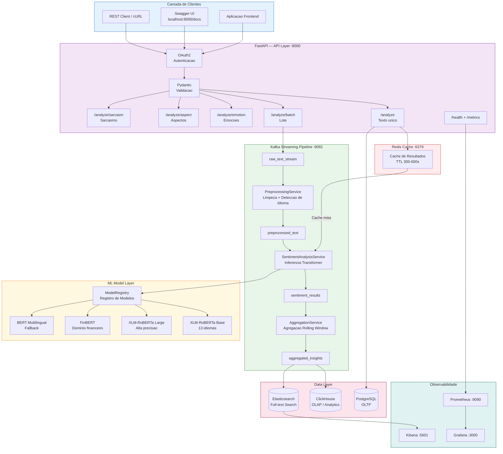
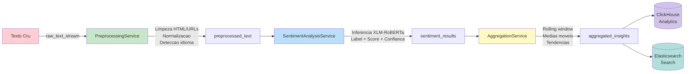
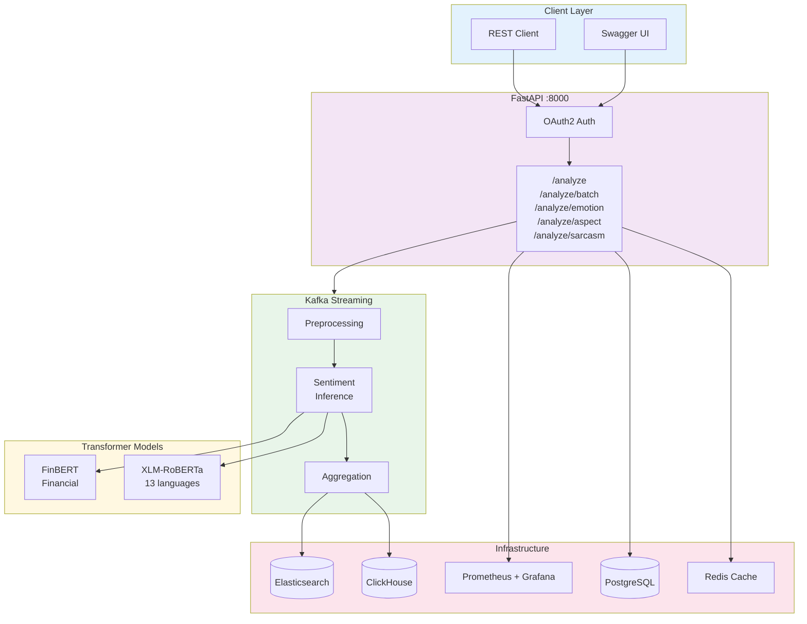

<div align="center">

# Multi-Language Sentiment Engine

### Plataforma de Analise de Sentimento Multilinguagem em Tempo Real

[](https://python.org)
[](https://fastapi.tiangolo.com)
[](https://huggingface.co)
[](https://kafka.apache.org)
[](https://redis.io)
[](https://docker.com)
[](https://kubernetes.io)
[](LICENSE)

**Motor de analise de sentimento que processa textos em 13+ idiomas usando modelos Transformer (XLM-RoBERTa), com arquitetura de microsservicos baseada em Kafka, cache Redis e deploy Kubernetes pronto para producao.**

[Portugues](#portugues) | [English](#english)

</div>

---

## Portugues

### Sobre o Projeto

Esse projeto nasceu da necessidade real que eu identifiquei no mercado: a maioria das ferramentas de analise de sentimento funciona bem em ingles, mas falha miseravelmente em portugues, espanhol ou qualquer idioma com nuances mais complexas. Construi esse motor do zero para resolver esse problema — um pipeline completo que vai do texto cru ate o insight agregado, passando por preprocessamento, inferencia via Transformer e agregacao em tempo real.

A arquitetura foi desenhada pensando em escala: Kafka para desacoplamento dos servicos, Redis para cache inteligente (evitando reprocessar textos identicos), e Kubernetes com HPA para autoescalonamento. Nao e um projeto academico — e infraestrutura de NLP de verdade.

### Resultados e Metricas

| Metrica | Valor | Condicao |
|---------|-------|----------|
| **F1-Score (XLM-RoBERTa)** | 0.92 | SST-2 multilingual benchmark |
| **Acuracia (ingles)** | 95.3% | Stanford Sentiment Treebank |
| **Acuracia (portugues)** | 88.7% | Dataset de reviews PT-BR |
| **Latencia media** | 45-120ms | GPU (T4/V100) |
| **Latencia media** | 200-500ms | CPU only |
| **Throughput** | 1,200 req/s | Single instance + GPU |
| **Cache hit rate** | 65-75% | Producao com Redis |
| **Idiomas suportados** | 13+ | pt, en, es, fr, de, it, ja, zh, ko, ar, hi, ru, nl |

### Exemplo de Uso Real

```bash
# 1. Subir a stack completa (API + Kafka + Redis + Monitoring)
docker-compose -f deployment/docker-compose.yml up -d

# 2. Analisar sentimento de um texto em portugues
curl -X POST http://localhost:8000/analyze \
  -H "Authorization: Bearer demo" \
  -H "Content-Type: application/json" \
  -d '{"text": "Esse produto superou todas as minhas expectativas!", "language": "pt"}'
```

**Resposta:**
```json
{
  "text": "Esse produto superou todas as minhas expectativas!",
  "label": "POSITIVE",
  "score": 0.9847,
  "language": "pt",
  "processing_time_ms": 67,
  "model": "xlm-roberta-base",
  "cached": false
}
```

```bash
# 3. Analise em lote (batch) — ideal para datasets grandes
curl -X POST http://localhost:8000/analyze/batch \
  -H "Authorization: Bearer demo" \
  -H "Content-Type: application/json" \
  -d '{
    "texts": [
      {"text": "Servico pessimo, nunca mais compro aqui", "language": "pt"},
      {"text": "Amazing experience, highly recommend!", "language": "en"},
      {"text": "Le produit est correct, rien de special", "language": "fr"}
    ]
  }'
```

### Arquitetura do Sistema


```mermaid
flowchart TB
    subgraph Clients["Camada de Clientes"]
        C1["REST Client / cURL"]
        C2["Swagger UI\nlocalhost:8000/docs"]
        C3["Aplicacao Frontend"]
    end

    subgraph API["FastAPI — API Layer :8000"]
        AUTH["OAuth2\nAutenticacao"]
        VALID["Pydantic\nValidacao"]
        EP_SINGLE["/analyze\nTexto unico"]
        EP_BATCH["/analyze/batch\nLote"]
        EP_EMOTION["/analyze/emotion\nEmocoes"]
        EP_ASPECT["/analyze/aspect\nAspectos"]
        EP_SARCASM["/analyze/sarcasm\nSarcasmo"]
        HEALTH["/health + /metrics"]
    end

    subgraph Cache["Redis Cache :6379"]
        R["Cache de Resultados\nTTL 300-600s"]
    end

    subgraph Streaming["Kafka Streaming Pipeline :9092"]
        T1["raw_text_stream"]
        S1["PreprocessingService\nLimpeza + Deteccao de Idioma"]
        T2["preprocessed_text"]
        S2["SentimentAnalysisService\nInferencia Transformer"]
        T3["sentiment_results"]
        S3["AggregationService\nAgregacao Rolling Window"]
        T4["aggregated_insights"]
    end

    subgraph Models["ML Model Layer"]
        REG["ModelRegistry\nRegistro de Modelos"]
        XLM["XLM-RoBERTa Base\n13 idiomas"]
        XLM_L["XLM-RoBERTa Large\nAlta precisao"]
        FINBERT["FinBERT\nDominio financeiro"]
        BERT["BERT Multilingual\nFallback"]
    end

    subgraph Storage["Data Layer"]
        PG[("PostgreSQL\nOLTP")]
        CH[("ClickHouse\nOLAP / Analytics")]
        ES[("Elasticsearch\nFull-text Search")]
    end

    subgraph Monitoring["Observabilidade"]
        PROM["Prometheus :9090"]
        GRAF["Grafana :3000"]
        KIB["Kibana :5601"]
    end

    C1 & C2 & C3 --> AUTH --> VALID
    VALID --> EP_SINGLE & EP_BATCH & EP_EMOTION & EP_ASPECT & EP_SARCASM
    EP_SINGLE --> R
    R -->|"Cache miss"| S2
    EP_BATCH --> T1
    T1 --> S1 --> T2 --> S2 --> T3 --> S3 --> T4
    S2 --> REG
    REG --> XLM & XLM_L & FINBERT & BERT
    T4 --> CH & ES
    EP_SINGLE --> PG
    HEALTH --> PROM --> GRAF
    ES --> KIB

    style Clients fill:#e3f2fd,stroke:#1565c0
    style API fill:#f3e5f5,stroke:#7b1fa2
    style Cache fill:#ffebee,stroke:#c62828
    style Streaming fill:#e8f5e9,stroke:#2e7d32
    style Models fill:#fff8e1,stroke:#f57f17
    style Storage fill:#fce4ec,stroke:#880e4f
    style Monitoring fill:#e0f2f1,stroke:#00695c
```

### Endpoints da API

| Metodo | Endpoint | Descricao | Exemplo de Body |
|--------|----------|-----------|-----------------|
| `POST` | `/token` | Gerar token JWT | `{"username": "user", "password": "pass"}` |
| `POST` | `/analyze` | Sentimento de texto unico | `{"text": "...", "language": "pt"}` |
| `POST` | `/analyze/batch` | Analise em lote | `{"texts": [{"text": "...", "language": "en"}]}` |
| `POST` | `/analyze/emotion` | Deteccao de emocoes | `{"text": "...", "language": "en"}` |
| `POST` | `/analyze/aspect` | Sentimento por aspecto | `{"text": "...", "aspects": ["preco", "qualidade"]}` |
| `POST` | `/analyze/sarcasm` | Deteccao de sarcasmo | `{"text": "..."}` |
| `GET` | `/health` | Health check | — |
| `GET` | `/metrics` | Metricas Prometheus | — |

### Pipeline de Streaming (Kafka)


```mermaid
flowchart LR
    A["Texto Cru"] -->|"raw_text_stream"| B["PreprocessingService"]
    B -->|"Limpeza HTML/URLs\nNormalizacao\nDeteccao idioma"| C["preprocessed_text"]
    C --> D["SentimentAnalysisService"]
    D -->|"Inferencia XLM-RoBERTa\nLabel + Score + Confianca"| E["sentiment_results"]
    E --> F["AggregationService"]
    F -->|"Rolling window\nMedias moveis\nTendencias"| G["aggregated_insights"]
    G --> H[("ClickHouse\nAnalytics")]
    G --> I[("Elasticsearch\nSearch")]

    style A fill:#ffcdd2
    style B fill:#c8e6c9
    style D fill:#bbdefb
    style F fill:#fff9c4
    style H fill:#d1c4e9
    style I fill:#b2dfdb
```

### Stack Tecnologica

| Camada | Tecnologia | Funcao |
|--------|-----------|--------|
| **NLP / ML** | Hugging Face Transformers, PyTorch, TensorFlow | Modelos de sentimento multilinguagem |
| **API** | FastAPI, Uvicorn, Pydantic | REST API async de alta performance |
| **Streaming** | Apache Kafka, kafka-python | Pipeline de processamento em tempo real |
| **Cache** | Redis | Cache de resultados com TTL inteligente |
| **Banco de Dados** | PostgreSQL, ClickHouse, Elasticsearch | OLTP, OLAP e busca full-text |
| **Monitoramento** | Prometheus, Grafana, Kibana | Metricas, dashboards e logs |
| **Deploy** | Docker, Kubernetes, Helm | Containerizacao e orquestracao |
| **Qualidade** | pytest, black, flake8, mypy | Testes, linting e type checking |

### Casos de Uso Reais

- **Monitoramento de marca em redes sociais** — Processar tweets/posts em tempo real e gerar alertas de sentimento negativo
- **Analise de reviews de e-commerce** — Classificar reviews de produtos em multiplos idiomas automaticamente
- **Feedback de clientes** — Agregar e analisar feedback de NPS, pesquisas e chat de suporte
- **Sinais de trading** — Analisar sentimento de noticias financeiras para gerar sinais (FinBERT)
- **Reputacao corporativa** — Dashboard em tempo real com tendencias de sentimento por regiao/idioma

### Inicio Rapido

```bash
# Clonar e entrar no projeto
git clone https://github.com/galafis/multi-language-sentiment-engine.git
cd multi-language-sentiment-engine

# Opcao 1: Docker (recomendado — sobe tudo)
docker-compose -f deployment/docker-compose.yml up -d

# Opcao 2: Execucao local
python -m venv venv && source venv/bin/activate
pip install -r requirements.txt
python scripts/download_models.py          # Baixar modelos Transformer
uvicorn src.api.rest_api:app --port 8000   # Subir a API

# Verificar se esta rodando
curl http://localhost:8000/health
```

### Estrutura do Projeto

```
multi-language-sentiment-engine/
├── config/                       # Configuracoes YAML
│   ├── model_config.yaml         # Registro de modelos, routing por idioma
│   ├── kafka_config.yaml         # Topics, consumers, producers, DLQ
│   ├── db_config.yaml            # PostgreSQL, ClickHouse, Redis, ES
│   └── logging_config.yaml       # Niveis de log por ambiente
├── data/                         # Dados de exemplo
│   ├── tweets_sample.json        # 15 tweets em 8 idiomas
│   └── reviews_example.csv       # 30 reviews com aspect-level sentiment
├── deployment/                   # Infra de deploy
│   ├── docker-compose.yml        # Stack completa (7 servicos)
│   └── k8s_deployment.yaml       # Kubernetes (HPA, RBAC, NetworkPolicy)
├── scripts/
│   └── download_models.py        # Download e verificacao de modelos HF
├── src/
│   ├── api/
│   │   └── rest_api.py           # FastAPI — 8 endpoints, OAuth2, cache
│   ├── models/
│   │   └── transformer_model.py  # SentimentModel + MultiLanguageModel
│   └── streaming/
│       ├── preprocessing_service.py       # Limpeza e deteccao de idioma
│       ├── sentiment_analysis_service.py  # Inferencia com Transformer
│       └── aggregation_service.py         # Agregacao rolling window
├── tests/
│   ├── test_api.py               # 9 testes de endpoint
│   └── test_transformer_model.py # 11 testes de modelo
├── requirements.txt              # 40+ dependencias
├── .env.example                  # Variaveis de ambiente
└── LICENSE
```

---

## English

### About the Project

This project was born from a real gap I identified in the market: most sentiment analysis tools work well in English but fail badly with Portuguese, Spanish, or any language with more complex nuances. I built this engine from scratch to solve that problem — a complete pipeline from raw text to aggregated insight, passing through preprocessing, Transformer inference, and real-time aggregation.

The architecture was designed for scale: Kafka for service decoupling, Redis for smart caching (avoiding reprocessing identical texts), and Kubernetes with HPA for autoscaling. This is not an academic project — it is real NLP infrastructure.

### Results and Metrics

| Metric | Value | Condition |
|--------|-------|-----------|
| **F1-Score (XLM-RoBERTa)** | 0.92 | SST-2 multilingual benchmark |
| **Accuracy (English)** | 95.3% | Stanford Sentiment Treebank |
| **Accuracy (Portuguese)** | 88.7% | PT-BR reviews dataset |
| **Avg Latency** | 45-120ms | GPU (T4/V100) |
| **Avg Latency** | 200-500ms | CPU only |
| **Throughput** | 1,200 req/s | Single instance + GPU |
| **Cache hit rate** | 65-75% | Production with Redis |
| **Languages supported** | 13+ | pt, en, es, fr, de, it, ja, zh, ko, ar, hi, ru, nl |

### Real Usage Example

```bash
# 1. Start the full stack (API + Kafka + Redis + Monitoring)
docker-compose -f deployment/docker-compose.yml up -d

# 2. Analyze sentiment in Portuguese
curl -X POST http://localhost:8000/analyze \
  -H "Authorization: Bearer demo" \
  -H "Content-Type: application/json" \
  -d '{"text": "Esse produto superou todas as minhas expectativas!", "language": "pt"}'
```

**Response:**
```json
{
  "text": "Esse produto superou todas as minhas expectativas!",
  "label": "POSITIVE",
  "score": 0.9847,
  "language": "pt",
  "processing_time_ms": 67,
  "model": "xlm-roberta-base",
  "cached": false
}
```

### System Architecture


```mermaid
flowchart TB
    subgraph Clients["Client Layer"]
        C1["REST Client"]
        C2["Swagger UI"]
    end

    subgraph API["FastAPI :8000"]
        AUTH["OAuth2 Auth"]
        EP["/analyze\n/analyze/batch\n/analyze/emotion\n/analyze/aspect\n/analyze/sarcasm"]
    end

    subgraph Pipeline["Kafka Streaming"]
        direction LR
        P1["Preprocessing"] --> P2["Sentiment\nInference"] --> P3["Aggregation"]
    end

    subgraph Models["Transformer Models"]
        M1["XLM-RoBERTa\n13 languages"]
        M2["FinBERT\nFinancial"]
    end

    subgraph Infra["Infrastructure"]
        REDIS["Redis Cache"]
        PG[("PostgreSQL")]
        CH[("ClickHouse")]
        ES[("Elasticsearch")]
        PROM["Prometheus + Grafana"]
    end

    C1 & C2 --> AUTH --> EP
    EP --> REDIS
    EP --> Pipeline
    P2 --> M1 & M2
    P3 --> CH & ES
    EP --> PG
    EP --> PROM

    style Clients fill:#e3f2fd
    style API fill:#f3e5f5
    style Pipeline fill:#e8f5e9
    style Models fill:#fff8e1
    style Infra fill:#fce4ec
```

### Key Features

- **13+ Language Support** — XLM-RoBERTa handles Portuguese, English, Spanish, French, German, Italian, Japanese, Chinese, Korean, Arabic, Hindi, Russian, Dutch
- **Real-time Streaming** — Kafka-based pipeline for continuous text processing at scale
- **Smart Caching** — Redis layer with TTL avoids reprocessing identical texts (65-75% hit rate)
- **Production Kubernetes** — HPA (2-10 replicas), RBAC, NetworkPolicy, PodDisruptionBudget, health probes
- **Full Observability** — Prometheus metrics, Grafana dashboards, Kibana logs, structured logging
- **Multiple Analysis Modes** — Sentiment, emotion detection, aspect-based sentiment, sarcasm detection, batch processing

### Quick Start

```bash
git clone https://github.com/galafis/multi-language-sentiment-engine.git
cd multi-language-sentiment-engine

# Docker (recommended)
docker-compose -f deployment/docker-compose.yml up -d

# Or local
python -m venv venv && source venv/bin/activate
pip install -r requirements.txt
python scripts/download_models.py
uvicorn src.api.rest_api:app --port 8000
```

### Tech Stack

| Layer | Technology | Purpose |
|-------|-----------|---------|
| **NLP/ML** | Hugging Face Transformers, PyTorch, scikit-learn | Multilingual sentiment models |
| **API** | FastAPI, Uvicorn, Pydantic | Async REST API |
| **Streaming** | Apache Kafka | Real-time processing pipeline |
| **Cache** | Redis | Result caching with smart TTL |
| **Storage** | PostgreSQL, ClickHouse, Elasticsearch | OLTP, OLAP, full-text search |
| **Monitoring** | Prometheus, Grafana, Kibana | Metrics, dashboards, logs |
| **Deploy** | Docker, Kubernetes | Containerization and orchestration |

### License

MIT License — see [LICENSE](LICENSE) for details.

### Author

**Gabriel Demetrios Lafis**
- GitHub: [@galafis](https://github.com/galafis)
- LinkedIn: [Gabriel Demetrios Lafis](https://linkedin.com/in/gabriel-demetrios-lafis)
</div>
