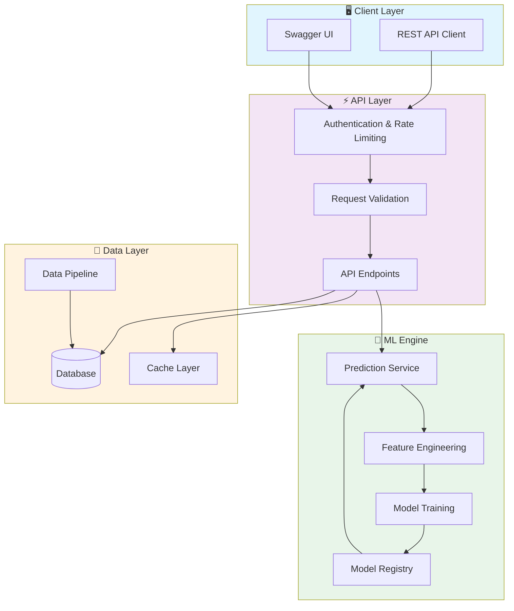
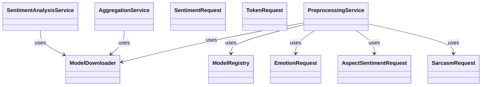

# 🗣️ Multi Language Sentiment Engine

> Advanced data science project: multi-language-sentiment-engine

[](https://img.shields.io/badge/)
[](https://img.shields.io/badge/)
[](https://img.shields.io/badge/)
[](https://img.shields.io/badge/)
[](https://img.shields.io/badge/)
[](https://img.shields.io/badge/)
[](https://img.shields.io/badge/)
[](https://img.shields.io/badge/)
[](https://img.shields.io/badge/)
[](https://img.shields.io/badge/)
[](LICENSE)

[English](#english) | [Português](#português)

---

## English

### 🎯 Overview

**Multi Language Sentiment Engine** is a production-grade Python application complemented by HTML that showcases modern software engineering practices including clean architecture, comprehensive testing, containerized deployment, and CI/CD readiness.

The codebase comprises **2,331 lines** of source code organized across **16 modules**, following industry best practices for maintainability, scalability, and code quality.

### ✨ Key Features

- **🗣️ Text Processing**: Tokenization, stemming, and lemmatization
- **📊 Sentiment Analysis**: Multi-language sentiment classification
- **🔍 Named Entity Recognition**: Entity extraction and classification
- **📈 Text Analytics**: TF-IDF, word embeddings, and topic modeling
- **⚡ Async API**: High-performance async REST API with FastAPI
- **📖 Auto-Documentation**: Interactive Swagger UI and ReDoc
- **✅ Validation**: Pydantic-powered request/response validation
- **📡 REST API**: 5 endpoints with full CRUD operations

### 🏗️ Architecture


```mermaid
graph TB
    subgraph Client["🖥️ Client Layer"]
        A[REST API Client]
        B[Swagger UI]
    end
    
    subgraph API["⚡ API Layer"]
        C[Authentication & Rate Limiting]
        D[Request Validation]
        E[API Endpoints]
    end
    
    subgraph ML["🤖 ML Engine"]
        F[Feature Engineering]
        G[Model Training]
        H[Prediction Service]
        I[Model Registry]
    end
    
    subgraph Data["💾 Data Layer"]
        J[(Database)]
        K[Cache Layer]
        L[Data Pipeline]
    end
    
    A --> C
    B --> C
    C --> D --> E
    E --> H
    E --> J
    H --> F --> G
    G --> I
    I --> H
    E --> K
    L --> J
    
    style Client fill:#e1f5fe
    style API fill:#f3e5f5
    style ML fill:#e8f5e9
    style Data fill:#fff3e0
```


```mermaid
classDiagram
    class PreprocessingService
    class EmotionRequest
    class ModelDownloader
    class AspectSentimentRequest
    class SarcasmRequest
    class SentimentAnalysisService
    class SentimentRequest
    class TokenRequest
    class ModelRegistry
    class AggregationService
    PreprocessingService --> ModelDownloader : uses
    PreprocessingService --> ModelRegistry : uses
    SentimentAnalysisService --> ModelDownloader : uses
    AggregationService --> ModelDownloader : uses
    PreprocessingService --> EmotionRequest : uses
    PreprocessingService --> AspectSentimentRequest : uses
    PreprocessingService --> SarcasmRequest : uses
```

### 📡 API Endpoints

| Method | Endpoint | Description |
|--------|----------|-------------|
| `POST` | `/token` | Create Token |
| `GET` | `/health` | Retrieve Health |
| `GET` | `/metrics` | Retrieve Metrics |
| `POST` | `/analyze` | Create Analyze |
| `POST` | `/analyze/batch` | Create Analyze → Batch |

### 🚀 Quick Start

#### Prerequisites

- Python 3.12+
- pip (Python package manager)
- Docker and Docker Compose (optional)

#### Installation

```bash
# Clone the repository
git clone https://github.com/galafis/multi-language-sentiment-engine.git
cd multi-language-sentiment-engine

# Create and activate virtual environment
python -m venv venv
source venv/bin/activate  # On Windows: venv\Scripts\activate

# Install dependencies
pip install -r requirements.txt
```

#### Running

```bash
# Run the application
python src/main.py
```

### 🐳 Docker

```bash
# Start all services
docker-compose up -d

# View logs
docker-compose logs -f

# Stop all services
docker-compose down

# Rebuild after changes
docker-compose up -d --build
```

### 🧪 Testing

```bash
# Run all tests
pytest

# Run with coverage report
pytest --cov --cov-report=html

# Run specific test module
pytest tests/test_main.py -v

# Run with detailed output
pytest -v --tb=short
```

### 📁 Project Structure

```
multi-language-sentiment-engine/
├── config/        # Configuration
│   ├── README.md
│   ├── __init__.py
│   ├── db_config.yaml
│   ├── kafka_config.yaml
│   ├── logging_config.yaml
│   └── model_config.yaml
├── data/
│   ├── __init__.py
│   └── tweets_sample.json
├── deployment/
│   ├── Dockerfile
│   ├── README.md
│   ├── docker-compose.yml
│   └── k8s_deployment.yaml
├── docs/          # Documentation
│   └── README.md
├── scripts/
│   └── download_models.py
├── src/          # Source code
│   ├── api/           # API endpoints
│   │   └── rest_api.py
│   ├── data/
│   │   └── __init__.py
│   ├── evaluation/
│   │   └── __init__.py
│   ├── models/        # Data models
│   │   └── transformer_model.py
│   ├── preprocessing/
│   │   ├── README.md
│   │   └── __init__.py
│   ├── streaming/
│   │   ├── aggregation_service.py
│   │   ├── preprocessing_service.py
│   │   └── sentiment_analysis_service.py
│   └── visualization/
│       └── __init__.py
├── tests/         # Test suite
│   ├── README.md
│   ├── __init__.py
│   ├── test_api.py
│   └── test_transformer_model.py
├── CONTRIBUTING.md
├── LICENSE
├── README.md
└── requirements.txt
```

### 🛠️ Tech Stack

| Technology | Description | Role |
|------------|-------------|------|
| **Python** | Core Language | Primary |
| **FastAPI** | High-performance async web framework | Framework |
| **Gin** | Go web framework | Framework |
| **MLflow** | ML lifecycle management | Framework |
| **NumPy** | Numerical computing | Framework |
| **Pandas** | Data manipulation library | Framework |
| **Prometheus** | Monitoring & alerting | Framework |
| **Redis** | In-memory data store | Framework |
| **scikit-learn** | Machine learning library | Framework |
| **TensorFlow** | Deep learning framework | Framework |
| HTML | 1 files | Supporting |

### 🚀 Deployment

#### Cloud Deployment Options

The application is containerized and ready for deployment on:

| Platform | Service | Notes |
|----------|---------|-------|
| **AWS** | ECS, EKS, EC2 | Full container support |
| **Google Cloud** | Cloud Run, GKE | Serverless option available |
| **Azure** | Container Instances, AKS | Enterprise integration |
| **DigitalOcean** | App Platform, Droplets | Cost-effective option |

```bash
# Production build
docker build -t multi-language-sentiment-engine:latest .

# Tag for registry
docker tag multi-language-sentiment-engine:latest registry.example.com/multi-language-sentiment-engine:latest

# Push to registry
docker push registry.example.com/multi-language-sentiment-engine:latest
```

### 🤝 Contributing

Contributions are welcome! Please feel free to submit a Pull Request. For major changes, please open an issue first to discuss what you would like to change.

1. Fork the project
2. Create your feature branch (`git checkout -b feature/AmazingFeature`)
3. Commit your changes (`git commit -m 'Add some AmazingFeature'`)
4. Push to the branch (`git push origin feature/AmazingFeature`)
5. Open a Pull Request

### 📄 License

This project is licensed under the MIT License - see the [LICENSE](LICENSE) file for details.

### 👤 Author

**Gabriel Demetrios Lafis**
- GitHub: [@galafis](https://github.com/galafis)
- LinkedIn: [Gabriel Demetrios Lafis](https://linkedin.com/in/gabriel-demetrios-lafis)

---

## Português

### 🎯 Visão Geral

**Multi Language Sentiment Engine** é uma aplicação Python de nível profissional, complementada por HTML que demonstra práticas modernas de engenharia de software, incluindo arquitetura limpa, testes abrangentes, implantação containerizada e prontidão para CI/CD.

A base de código compreende **2,331 linhas** de código-fonte organizadas em **16 módulos**, seguindo as melhores práticas do setor para manutenibilidade, escalabilidade e qualidade de código.

### ✨ Funcionalidades Principais

- **🗣️ Text Processing**: Tokenization, stemming, and lemmatization
- **📊 Sentiment Analysis**: Multi-language sentiment classification
- **🔍 Named Entity Recognition**: Entity extraction and classification
- **📈 Text Analytics**: TF-IDF, word embeddings, and topic modeling
- **⚡ Async API**: High-performance async REST API with FastAPI
- **📖 Auto-Documentation**: Interactive Swagger UI and ReDoc
- **✅ Validation**: Pydantic-powered request/response validation
- **📡 REST API**: 5 endpoints with full CRUD operations

### 🏗️ Arquitetura


```mermaid
graph TB
    subgraph Client["🖥️ Client Layer"]
        A[REST API Client]
        B[Swagger UI]
    end
    
    subgraph API["⚡ API Layer"]
        C[Authentication & Rate Limiting]
        D[Request Validation]
        E[API Endpoints]
    end
    
    subgraph ML["🤖 ML Engine"]
        F[Feature Engineering]
        G[Model Training]
        H[Prediction Service]
        I[Model Registry]
    end
    
    subgraph Data["💾 Data Layer"]
        J[(Database)]
        K[Cache Layer]
        L[Data Pipeline]
    end
    
    A --> C
    B --> C
    C --> D --> E
    E --> H
    E --> J
    H --> F --> G
    G --> I
    I --> H
    E --> K
    L --> J
    
    style Client fill:#e1f5fe
    style API fill:#f3e5f5
    style ML fill:#e8f5e9
    style Data fill:#fff3e0
```

### 📡 API Endpoints

| Method | Endpoint | Description |
|--------|----------|-------------|
| `POST` | `/token` | Create Token |
| `GET` | `/health` | Retrieve Health |
| `GET` | `/metrics` | Retrieve Metrics |
| `POST` | `/analyze` | Create Analyze |
| `POST` | `/analyze/batch` | Create Analyze → Batch |

### 🚀 Início Rápido

#### Prerequisites

- Python 3.12+
- pip (Python package manager)
- Docker and Docker Compose (optional)

#### Installation

```bash
# Clone the repository
git clone https://github.com/galafis/multi-language-sentiment-engine.git
cd multi-language-sentiment-engine

# Create and activate virtual environment
python -m venv venv
source venv/bin/activate  # On Windows: venv\Scripts\activate

# Install dependencies
pip install -r requirements.txt
```

#### Running

```bash
# Run the application
python src/main.py
```

### 🐳 Docker

```bash
# Start all services
docker-compose up -d

# View logs
docker-compose logs -f

# Stop all services
docker-compose down

# Rebuild after changes
docker-compose up -d --build
```

### 🧪 Testing

```bash
# Run all tests
pytest

# Run with coverage report
pytest --cov --cov-report=html

# Run specific test module
pytest tests/test_main.py -v

# Run with detailed output
pytest -v --tb=short
```

### 📁 Estrutura do Projeto

```
multi-language-sentiment-engine/
├── config/        # Configuration
│   ├── README.md
│   ├── __init__.py
│   ├── db_config.yaml
│   ├── kafka_config.yaml
│   ├── logging_config.yaml
│   └── model_config.yaml
├── data/
│   ├── __init__.py
│   └── tweets_sample.json
├── deployment/
│   ├── Dockerfile
│   ├── README.md
│   ├── docker-compose.yml
│   └── k8s_deployment.yaml
├── docs/          # Documentation
│   └── README.md
├── scripts/
│   └── download_models.py
├── src/          # Source code
│   ├── api/           # API endpoints
│   │   └── rest_api.py
│   ├── data/
│   │   └── __init__.py
│   ├── evaluation/
│   │   └── __init__.py
│   ├── models/        # Data models
│   │   └── transformer_model.py
│   ├── preprocessing/
│   │   ├── README.md
│   │   └── __init__.py
│   ├── streaming/
│   │   ├── aggregation_service.py
│   │   ├── preprocessing_service.py
│   │   └── sentiment_analysis_service.py
│   └── visualization/
│       └── __init__.py
├── tests/         # Test suite
│   ├── README.md
│   ├── __init__.py
│   ├── test_api.py
│   └── test_transformer_model.py
├── CONTRIBUTING.md
├── LICENSE
├── README.md
└── requirements.txt
```

### 🛠️ Stack Tecnológica

| Tecnologia | Descrição | Papel |
|------------|-----------|-------|
| **Python** | Core Language | Primary |
| **FastAPI** | High-performance async web framework | Framework |
| **Gin** | Go web framework | Framework |
| **MLflow** | ML lifecycle management | Framework |
| **NumPy** | Numerical computing | Framework |
| **Pandas** | Data manipulation library | Framework |
| **Prometheus** | Monitoring & alerting | Framework |
| **Redis** | In-memory data store | Framework |
| **scikit-learn** | Machine learning library | Framework |
| **TensorFlow** | Deep learning framework | Framework |
| HTML | 1 files | Supporting |

### 🚀 Deployment

#### Cloud Deployment Options

The application is containerized and ready for deployment on:

| Platform | Service | Notes |
|----------|---------|-------|
| **AWS** | ECS, EKS, EC2 | Full container support |
| **Google Cloud** | Cloud Run, GKE | Serverless option available |
| **Azure** | Container Instances, AKS | Enterprise integration |
| **DigitalOcean** | App Platform, Droplets | Cost-effective option |

```bash
# Production build
docker build -t multi-language-sentiment-engine:latest .

# Tag for registry
docker tag multi-language-sentiment-engine:latest registry.example.com/multi-language-sentiment-engine:latest

# Push to registry
docker push registry.example.com/multi-language-sentiment-engine:latest
```

### 🤝 Contribuindo

Contribuições são bem-vindas! Sinta-se à vontade para enviar um Pull Request.

### 📄 Licença

Este projeto está licenciado sob a Licença MIT - veja o arquivo [LICENSE](LICENSE) para detalhes.

### 👤 Autor

**Gabriel Demetrios Lafis**
- GitHub: [@galafis](https://github.com/galafis)
- LinkedIn: [Gabriel Demetrios Lafis](https://linkedin.com/in/gabriel-demetrios-lafis)
